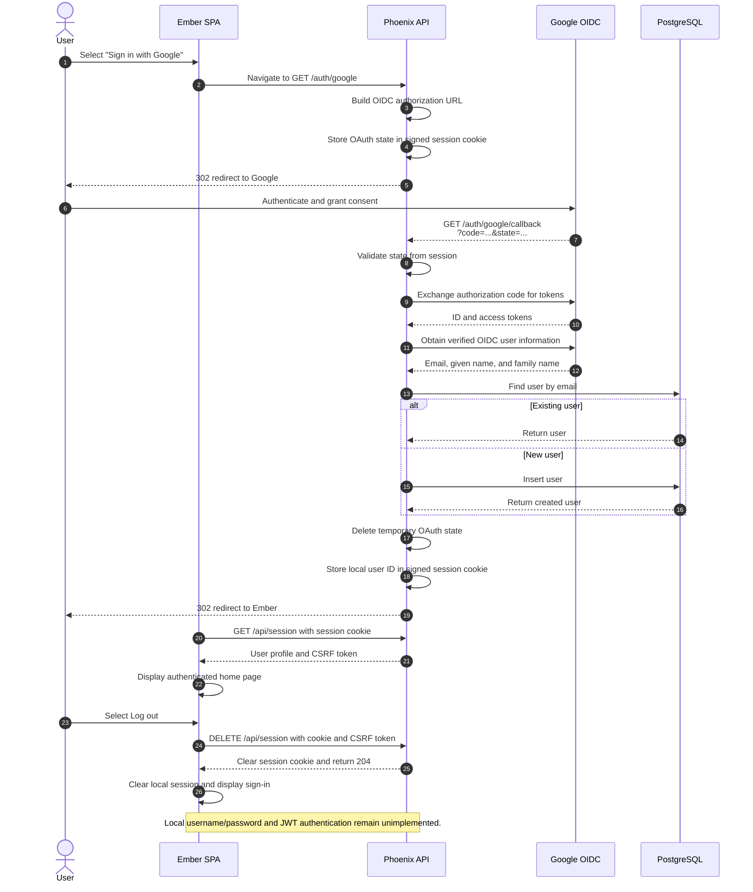

# Phoenix + Ember: OAuth & JWT Authentication

Implements authentication for a Phoenix + Ember application using two strategies: SSO via Google OAuth 2.0/OIDC and local authentication wit
h JWT for direct username/password login.

## Running Locally

### Prerequisites

- Docker with Docker Compose
- Elixir `~> 1.15` and a compatible Erlang/OTP version
- Node.js 20 or newer with npm
- A Google OAuth client for testing Google sign-in

Configure the Google OAuth client with this authorized redirect URI:

```text
http://localhost:4000/auth/google/callback
```

### First-time setup

Start PostgreSQL from the repository root:

```bash
docker compose up -d db
```

Install dependencies and prepare the development database:

```bash
cd api
mix setup

cd ../web
npm install
```

### Start the Phoenix API

In one terminal:

```bash
cd api
export GOOGLE_CLIENT_ID="your-google-client-id"
export GOOGLE_CLIENT_SECRET="your-google-client-secret"
mix phx.server
```

The API runs at [http://localhost:4000](http://localhost:4000). Keep the credentials in environment variables and do not commit them.

### Start the Ember app

In another terminal:

```bash
cd web
npm run start
```

Open [http://localhost:4200](http://localhost:4200). Visiting `/` shows your name, email, and a **Log out** button when signed in; otherwise it redirects to `/sign-in`. The Google button starts the OIDC flow through the Phoenix API. On return, Ember reads `/api/session` with the session cookie to display the authenticated home page. Refreshing the page restores the session; logging out clears it and returns to sign-in.

### Stop PostgreSQL

From the repository root:

```bash
docker compose stop db
```

## OAuth 2.0 Key Concepts

| Concept | Role | In this project |
|---|---|---|
| **Resource Owner** | The user granting access | The person logging in via Google |
| **Client** | The app requesting access on the user's behalf | The Ember frontend |
| **Authorization Server** | Issues tokens after authenticating the user | Google (`accounts.google.com`) |
| **Resource Server** | Hosts the protected resources | The Phoenix API |
| **Authorization Grant** | Proof that the user consented | The `code` Google sends back to `/auth/google/callback` |

The flow in this project uses the **Authorization Code** grant type: Ember redirects the user to Google, Google authenticates them and redirects back with a short-lived `code`, and the Phoenix API exchanges that `code` for tokens directly with Google — keeping secrets server-side.

## SSO Authentication Flow


