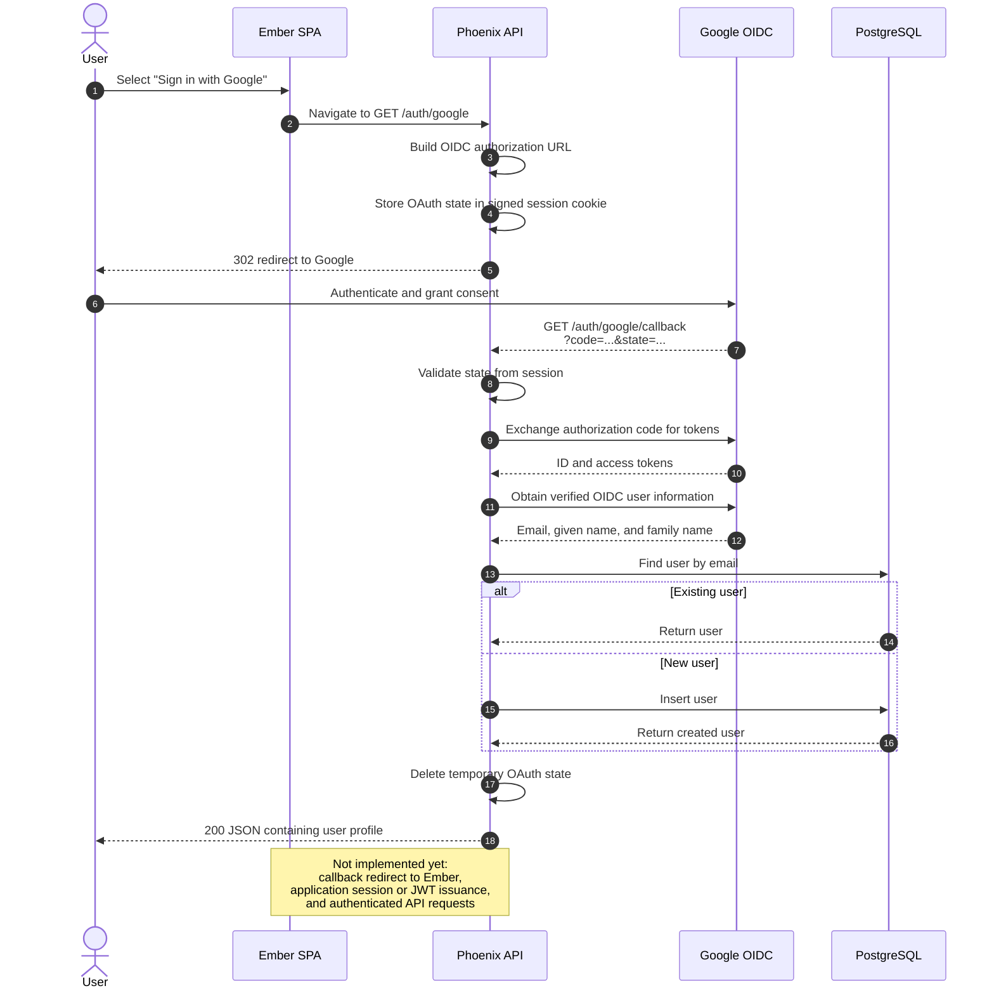

# Phoenix + Ember: OAuth & JWT Authentication

Implements authentication for a Phoenix + Ember application using two strategies: SSO via Google OAuth 2.0/OIDC and local authentication with JWT for direct username/password login.

## OAuth 2.0 Key Concepts

| Concept | Role | In this project |
|---|---|---|
| **Resource Owner** | The user granting access | The person logging in via Google |
| **Client** | The app requesting access on the user's behalf | The Ember frontend |
| **Authorization Server** | Issues tokens after authenticating the user | Google (`accounts.google.com`) |
| **Resource Server** | Hosts the protected resources | The Phoenix API |
| **Authorization Grant** | Proof that the user consented | The `code` Google sends back to `/auth/google/callback` |

The flow in this project uses the **Authorization Code** grant type: Ember redirects the user to Google, Google authenticates them and redirects back with a short-lived `code`, and the Phoenix API exchanges that `code` for tokens directly with Google — keeping secrets server-side.

## SSO Authentication Flow

